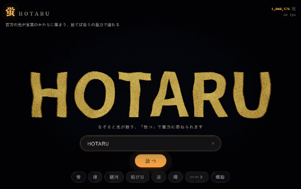
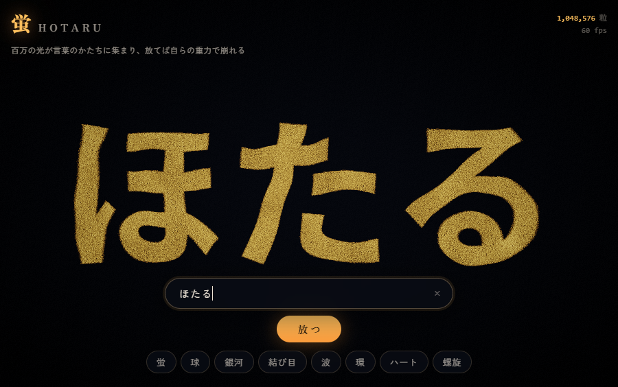
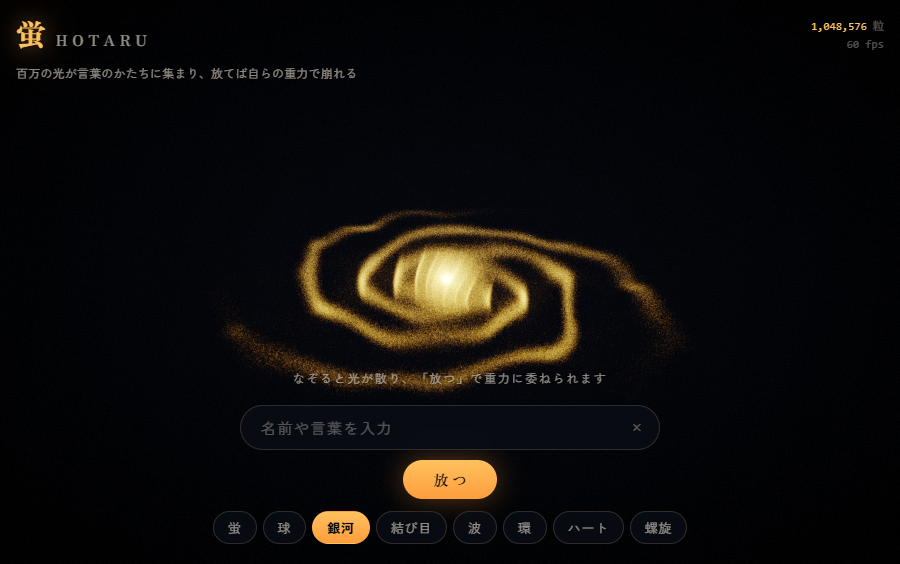
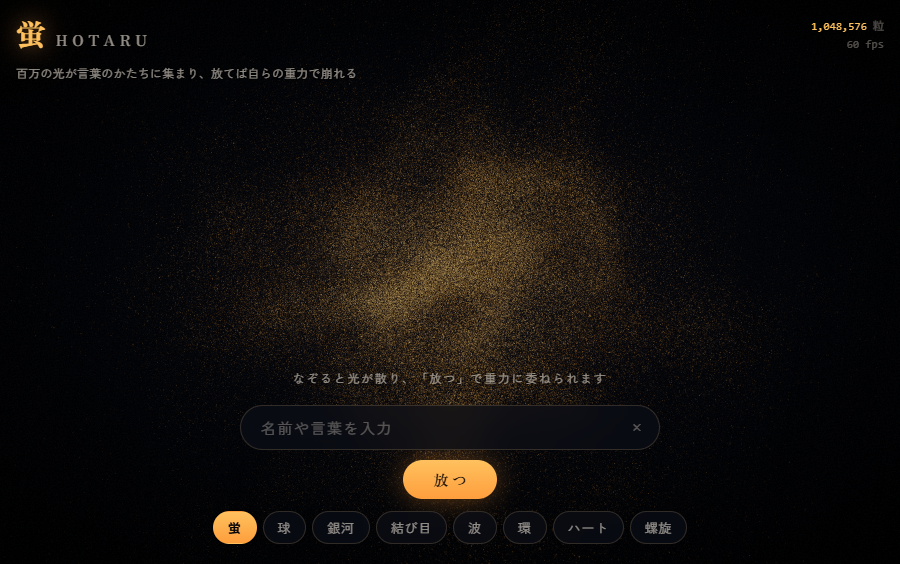
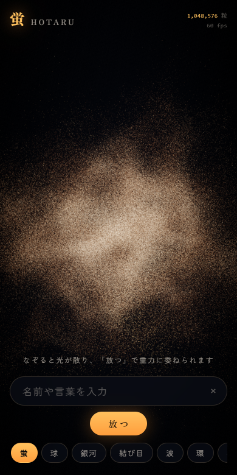

<h1 align="center">蛍 &nbsp;Hotaru</h1>

<p align="center">
  百万個の光の粒が、打ち込んだ言葉のかたちに集まる。<br>
  そして「放つ」と、言葉は自らの重力で崩れる。
</p>

<p align="center">
  <a href="https://futurecortexlabs.github.io/FCTX_HOTARU/"><b>▶ デモを開く</b></a>
  &nbsp;·&nbsp;
  <a href="README.md">English</a>
  &nbsp;·&nbsp;
  <a href="#自己重力">物理の話</a>
</p>

<p align="center">
  
</p>

<p align="center">
  <sub>一コマもキーフレームを打っていません。文字を保持していたバネを切り、自己重力を入れただけ。
  15秒ぶんのシミュレーションを2倍速で再生しています。</sub>
</p>

---

## これは何か

**HTML 1ファイル**です。依存ライブラリなし、バンドラなし、three.js なし。開けば動きます。

- **言葉を打つ** — 百万個の粒子がその形へ飛ぶ。ラテン文字、ひらがな、漢字、絵文字
- **画面をドラッグ** — 粒子が散り、渦を巻き、また戻る
- **「放つ」を押す** — バネが切れ、粒子が**互いに**引き合いはじめる。言葉は自重でたわみ、
  重力で束ねられた塊に分裂し、塊の間にフィラメントを引き、やがて回転円盤に落ち着く
- **7種の形** — 球・銀河・結び目・波・環・ハート・螺旋

同じ言葉を二度放っても、同じ形にはなりません。再生ではなくシミュレーションだからです。

<table>
<tr>
<td width="50%"></td>
<td width="50%"></td>
</tr>
<tr>
<td></td>
<td align="center"></td>
</tr>
</table>

---

## 動かす

**オンライン** — [futurecortexlabs.github.io/FCTX_HOTARU](https://futurecortexlabs.github.io/FCTX_HOTARU/)

**手元で** — clone して `docs/index.html` をブラウザで開くだけ。サーバもインストールも不要です。

**ソースから**

```bash
node build-hotaru.js    # 6モジュール + シェル + グルー  ->  docs/index.html
npm test                # 5,335件のテスト
```

必要なのは Node だけです。`puppeteer-core` は検証ハーネス専用の開発依存で、
インストール済みの Chrome を駆動するために使います。

URL に `?n=65536` を付けると粒子数を固定できます（非力な端末向け）。

---

## 仕組み

毎フレーム、以下が GPU 上で走ります。

```
位置 / 速度テクスチャ  (RGBA32F, 1024x1024)
        |
        +- (1) 質量堆積 ---- 百万粒を加算ブレンドで 64^3 格子へ描く
        |                     （512x512 テクスチャに Z スライスをタイル配置）
        +- (2) ポアソン解 -- ∇²φ = 4πGρ を Chebyshev 加速緩和で 24 パス
        |                     前フレームの解から暖機始動
        +- (3) 力の取得 ---- -∇φ を三重線形補間で各粒子へ戻す
        |
        +- (4) 積分 -------- 1枚のフラグメントシェーダが MRT で
        |                     位置と速度を同時に書き戻す
        +- (5) 描画 -------- gl.POINTS を gl_VertexID で引く（頂点バッファ無し）
        +- (6) ポスト ------ 自動露出 -> ブライトパス -> 分離ブラー -> ACES 合成
```

粒子の配列も頂点バッファも存在しません。描画は
`drawArrays(POINTS, 0, 1048576)` の1回だけで、頂点シェーダが `gl_VertexID` から
自分の粒子をテクスチャ読みします。

露出は自動です。シーンのミップマップ連鎖を1テクセルまで縮約し、1×1バッファで時間平滑して、
合成時のゲインに使っています。密度が2桁変わるシミュレーションを手で露出調整するのは無理だからです。

---

## 自己重力

百万体の直接和は毎フレーム 10¹² 回の計算になり不可能です。そこで宇宙論の N 体計算と同じ
**Particle-Mesh 法**を使います。

1. **堆積** — 粒子を最近傍セルへ加算描画する
2. **求解** — 離散ポアソン方程式を解いてポテンシャルを得る。周期境界では解が一意に定まらないため、
   平均密度を差し引く（Jeans の swindle）
3. **微分** — ポテンシャルの勾配を取り、力を粒子へ補間して戻す

### なぜ Chebyshev なのか、そしてその数字の出どころ

素朴なヤコビ法は、重力が最も必要とする**長波長成分**の収束が極端に遅い。
パス数を勘で決める代わりに、このリポジトリは**厳密な CPU 参照実装**を持っています。
[`hotaru/pm.js`](hotaru/pm.js)（3次元 FFT によるポアソン解法）がそれで、
[`test/pm.test.js`](test/pm.test.js) が GPU に必要なパス数を実測します。

前フレームから暖機始動した状態での、毎フレームの必要パス数。評価指標は「粒子へ補間して戻した
加速度の相対L2誤差」で、**同一ステンシル**のFFT解と突き合わせているため、反復誤差だけを見ています。

| 格子 | ヤコビ → 3% | ヤコビ → 1% | Chebyshev → 3% | Chebyshev → 1% |
|:--|--:|--:|--:|--:|
| 32³ | 約 70 | 128超 | **約 9** | **約 15** |
| 64³ | 約 94 | 約 210 | **約 10** | **約 26** |
| 128³ | 約 158 | 256超 | **約 15** | **約 42** |

これは調整の失敗ではなく、作用素のスペクトルそのものです。ヤコビ掃引は最も遅いモードを
1パスあたり `(2 + cos(2π/N))/3` — 64³ なら 0.9984 — しか減衰させられません。そして
φ<sub>k</sub> ~ ρ<sub>k</sub>/k² である以上、そのモードこそがポテンシャルの power の大半を
担っています。同じ掃引に Chebyshev 半復法をかけると 1パスあたり 0.9449 になる。条件数の
平方根ぶんの高速化で、完全に並列、しかも Z スライス配置の中で赤黒のパリティを考える必要も
ありません。

ステンシルは完全に同一で、違うのは「何を書き戻すか」だけです。

```
x[k+1] = alpha[k] * (c1 * sweep(x[k]) - c2 * x[k]) - beta[k] * x[k-1]
```

ピンポンバッファが2枚から3枚になるだけ。`beta[0] = 0` なので初回パスは `x[k-1]` を読みません。
`c1`・`c2` は格子サイズのみ、`alpha`・`beta` は格子サイズとパス番号のみに依存するので、
パスごとに float ユニフォームが2個、一度計算すれば済みます。本実装は 64³ で **24 パス**。
力の誤差およそ1%で、素朴なヤコビなら約210パスを要する水準です。

平均密度の差し引きは省略不可で、しかもコストゼロです。生の密度で緩和すると、箱に正味の質量が
ある以上、毎パス平均ポテンシャルが一定量ずつずれ続けて相殺されません（32³ で200パス後に
−0.409、予測と 1e-9 で一致、線形に滑り続ける）。float32 では有用な場が大きな数の下位ビットに
埋もれてしまいます。この平均に GPU 側の縮約は要りません。CIC 堆積は質量をビット単位で厳密に
保存するので、`totalMass / L³` という既知の定数だからです。

**ここが実測する価値のあった部分です。** パス数が足りないとき、ソルバは目に見えるノイズを
出しません。多数のセルにまたがる**滑らかで一貫したバイアス**を出します。もっともらしく見えたまま、
静かに間違った場になる。画面を眺めていても絶対に気づけません。

### 本当に落ちているのか

場が画面を覆ってしまうと、崩壊と膨張は目で区別できません。そこで
[`tools/probe-gravity.js`](tools/probe-gravity.js) が位置テクスチャを読み戻し、
雲の半径を直接測ります。静止した球、ノイズも初速もゼロ:

```
  t=0   rms 1.002
  t=3   rms 0.887   収縮
  t=5   rms 0.654   収縮
  t=7   rms 0.168   収縮
  t=8   rms 0.255   膨張   <- 中心を通過して跳ね返る
```

自由落下時間の理論値 6.2 秒に対して実測 7 秒。散逸のない冷たい崩壊が中心を通り抜けて
跳ね返るところまで、教科書どおりです。

---

## 検証

`npm test` が **5,335 件**を実行します。

| スイート | 件数 | 何を証明するか |
|:--|--:|:--|
| noise | 182 | 値域・連続性・カール場の発散が 10⁻³ 未満・GLSL と JS ミラーの一致 |
| shapes | 539 | 長さ・有限性・半径境界・決定性・形状ごとの構造。フィボナッチ球の最近傍間隔の変動係数は 0.015、銀河の腕は角度ヒストグラムで 24 倍のコントラスト |
| mask | 4,290 | 全サンプル点が発光画素上に着地・アスペクト保存・上下の向き・被覆の一様性 |
| atlas | 259 | セル↔テクセルの全単射、スライス境界と周期境界をまたぐ線形場の再現 |
| pm | 65 | 質量・運動量保存、2体円軌道、Plummer 球の平衡、自己力、そして上記のパス数測定 |

これとは別に [`tools/verify-hotaru.js`](tools/verify-hotaru.js) が実際の Chrome を起動し、
20の状態（待機・ドラッグ・日本語入力・ラテン入力・7形状・重力2〜28秒・携帯ビューポート）を
撮影して、シェーダ失敗・JSエラー・空画面を検査します。

---

## 性能

| | |
|:--|:--|
| 粒子数 | 1,048,576。自動的に段階を下げる。携帯は 262,144 から開始 |
| フレームレート | RTX 5070 Ti で 60 fps（垂直同期の上限に張り付き） |
| 毎フレームの重力計算 | 百万粒の堆積 + 512×512 上で 24 回のポアソン緩和 |
| サイズ | 単一の自己完結 HTML で約 170 KB |

---

## 既知の限界

近似を隠すデモは読む価値がないので、正直に書きます。

- **堆積は最近傍セル（NGP）、補間は三重線形**でカーネルが一致していません。厳密には
  わずかな自己力が生じます。点スプライトは1テクセルにしか書けないため CIC 堆積には
  8パス必要で、視覚作品としては割に合わないと判断しました。参照実装によれば、
  力が信頼できるのは約4セル以上離れた相手に対してです。
- **箱は周期境界**なので、遠方の鏡像からの力がわずかに残ります。箱は雲の数倍の大きさを
  取っていますが、ゼロではありません。
- **半径 2.4 を超えると人工的な封じ込め力**が働きます。周期境界の巻き込みを防ぐための
  事務処理であって、物理ではありません。
- **32bit float への加算ブレンドには `EXT_float_blend` が必要**です。無い環境では 16bit に
  フォールバックし、1セルあたり約 2,048 粒子を超えると加算が飽和します。
- **依存ゼロは矜持ではなく制約です。** ひとつ足した時点で、誰でも開ける1ファイル配布が
  終わってしまうからです。

---

## 構成

| パス | 中身 |
|:--|:--|
| [`hotaru/engine.js`](hotaru/engine.js) | WebGL2 の全て。GPGPU 積分、重力パイプライン、ブルーム、自動露出 |
| [`hotaru/atlas.js`](hotaru/atlas.js) | 3D格子を2Dテクスチャに畳む写像。GLSL と、それを検証する JS ミラー |
| [`hotaru/pm.js`](hotaru/pm.js) | CPU 側の厳密な参照ソルバ（FFT / ヤコビ / Chebyshev / SOR）。ブラウザには載りません |
| [`hotaru/noise.js`](hotaru/noise.js) | Simplex ノイズと、発散ゼロを数値検証したカール場 |
| [`hotaru/shapes.js`](hotaru/shapes.js) | 8種の決定的な手続き的生成器 |
| [`hotaru/mask.js`](hotaru/mask.js) | ラスタライズした字形から偏りなく点を取るサンプラー |
| [`web/`](web) | ページ本体。シェルとグルーコード |
| [`tools/`](tools) | Chrome を駆動する検証ハーネスと物理プローブ |

各モジュールは「グローバルを1つ公開する IIFE」なので、ビルドはただの連結です。

---

## ライセンス

[Apache License 2.0](LICENSE)

3次元 Simplex ノイズは Stefan Gustavson と Ashima Arts による実装の移植です（MIT）。
