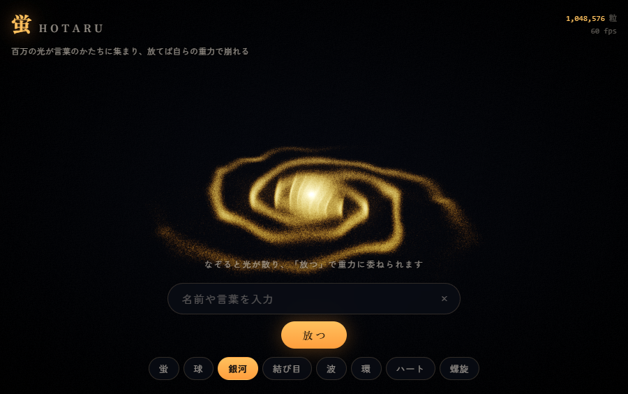

<h1 align="center">蛍 &nbsp;Hotaru</h1>

<p align="center"><b>English</b> | <a href="README.ja.md">日本語</a></p>

<p align="center">
  <b>Type a word. A million particles of light gather into its shape.<br>
  Let go, and it collapses under its own gravity.</b>
</p>

<p align="center">
  <a href="https://futurecortexlabs.github.io/FCTX_HOTARU/"><b>▶ Open the live demo</b></a>
  &nbsp;·&nbsp;
  <a href="#the-gravity-is-real">The physics</a>
  &nbsp;·&nbsp;
  <a href="#known-limits">Known limits</a>
</p>

<p align="center">
  
</p>

<p align="center">
  <sub>
  Nothing here is keyframed. At release, the spring holding each particle to its letter is switched off and self-gravity is switched on. The cloud gets one frame of small random velocity and a gentle spin — the spin is what flattens the remnant into a disc. Everything after that is computed, not animated. 15 seconds of simulation, played at 2×.
  </sub>
</p>

---

## What it is

A real-time particle artwork that runs in the browser — and underneath it, a genuine gravitational N-body simulation of a million particles on the GPU.

It is **one HTML file**: no libraries, no bundler, no three.js. Open it and it runs.

| What you do | What happens |
|:--|:--|
| **Type a word** | A million GPU particles fly into its shape. Latin letters, hiragana, kanji and emoji all work |
| **Drag across the screen** | The particles scatter, swirl, and settle back |
| **Press 放つ (Release)** | The spring holding them in place is cut and the particles start pulling on *each other*. The word sags under its own weight, breaks into clumps, draws filaments between them, and settles into a rotating disc. Press **戻す (Return)** to bring the shape back |
| **Pick a shape** | Sphere, galaxy, torus knot, wave, ring, heart, double helix — or **蛍**, the resting cloud. Release works on shapes too |

Release the same word twice and it never falls the same way. It is a simulation, not a recording.

> The on-screen interface is in Japanese. The only labels you need are **放つ** (Release) and **戻す** (Return); the input box accepts any language.

<table>
<tr>
<td width="50%"></td>
<td width="50%"></td>
</tr>
<tr>
<td></td>
<td align="center"></td>
</tr>
</table>

---

## Try it

- **Online** — [futurecortexlabs.github.io/FCTX_HOTARU](https://futurecortexlabs.github.io/FCTX_HOTARU/)
- **Offline** — clone the repository and open `index.html` in a browser. No server, no install.
- **Slow machine?** Add `?n=65536` to the URL to fix the particle count at 65,536.

A WebGL2 browser is required (current Chrome, Edge, Safari or Firefox).

### Build from source

```bash
node build-hotaru.js
```

```bash
npm test
```

The build joins the five modules in [`hotaru/`](hotaru) with the page in [`web/`](web) into `index.html`. The tests run 5,335 checks. Node 18+ is the only requirement; `puppeteer-core` is a dev dependency used only by the browser verification harness, which drives the Chrome you already have installed.

---

## How it works

Every frame, all of this runs on the GPU:

```
position / velocity textures  (RGBA32F, 1024x1024 = 1,048,576 particles)
        |
        +- 1. deposit    every particle adds its mass to a 64^3 grid
        |                (the grid is stored as z-slices in one 512x512 texture)
        +- 2. solve      solve grad^2 phi = 4 pi G rho for the gravitational potential:
        |                24 Chebyshev-accelerated passes, starting from last frame's answer
        +- 3. force      the force -grad(phi) is read back at each particle's position
        +- 4. integrate  one shader updates position AND velocity (multiple render targets)
        +- 5. draw       one draw call; each point looks itself up by gl_VertexID
        +- 6. post       auto-exposure -> bloom -> ACES tone mapping
```

There is no particle array on the CPU and no vertex buffer. The whole field is a single `drawArrays(POINTS, 0, 1048576)` call; each vertex fetches its own particle from a texture using its index.

Exposure is automatic. The rendered frame is averaged down to a single pixel, smoothed over time, and used as a brightness gain. Hand-tuning was not an option: during a collapse the density changes by a factor of a hundred.

---

## The gravity is real

Having every particle pull on every other directly would be 10¹² calculations per frame — impossible. Instead Hotaru uses the **Particle-Mesh method**, the same approach cosmological simulations use:

1. **Deposit** — add each particle's mass to the nearest cell of a 3D grid.
2. **Solve** — solve the Poisson equation on that grid to get the gravitational potential. Gravity in a periodic (wrap-around) box has no solution unless the average density is subtracted first; physicists call this the *Jeans swindle*.
3. **Differentiate** — take the slope of the potential to get the force, and interpolate it back to each particle.

### Why Chebyshev, and where the number 24 comes from

**In short:** the textbook solver (Jacobi iteration) would need about 210 passes per frame for 1% accuracy. A Chebyshev-accelerated version of the same solver gets there in about 24–26, and Hotaru uses 24. These figures were measured, not guessed.

Jacobi iteration is slowest to fix exactly the large-scale structure that gravity depends on most. So rather than guess how many passes are enough, the repository includes an **exact CPU reference solver** — [`hotaru/pm.js`](hotaru/pm.js), which solves the same equation exactly using a 3D FFT — and [`test/pm.test.js`](test/pm.test.js) measures how many GPU passes are needed to match it.

Passes per frame needed to reach 3% and 1% error in the force on each particle. Each frame starts from the previous frame's solution. Error is measured against the exact solution of the *same* discrete equation, so it counts only the error from stopping early:

| Grid | Jacobi → 3% | Jacobi → 1% | Chebyshev → 3% | Chebyshev → 1% |
|:--|--:|--:|--:|--:|
| 32³ | ~70 | >128 | **~9** | **~15** |
| 64³ | ~94 | ~210 | **~10** | **~26** |
| 128³ | ~158 | >256 | **~15** | **~42** |

<details>
<summary><b>The mathematics</b></summary>

The slowness is a property of the operator, not a tuning mistake. Each Jacobi sweep shrinks the error in its slowest mode by only `(2 + cos(2π/N))/3` per pass — 0.9984 at 64³ — and that mode carries most of the potential's power, because φ<sub>k</sub> ~ ρ<sub>k</sub>/k². Chebyshev semi-iteration over the same sweep shrinks it by 0.9449 per pass instead: the classic square-root-of-condition-number speedup. It stays fully parallel, and unlike red/black Gauss–Seidel there is no checkerboard ordering to work out inside a z-slice texture.

The stencil is unchanged; only what gets written back differs:

```
x[k+1] = alpha[k] * (c1 * sweep(x[k]) - c2 * x[k]) - beta[k] * x[k-1]
```

That means three ping-pong buffers instead of two. `beta[0] = 0`, so the first pass never reads `x[k-1]`. `c1` and `c2` depend only on the grid size, and `alpha` and `beta` only on the grid size and the pass number — two float uniforms per pass, computed once.

Subtracting the mean density is required, and costs nothing. Relax against the raw density and every pass shifts the average potential by a fixed amount that never cancels, because the box contains net mass — measured at −0.409 after 200 passes at 32³, matching the prediction to 1e-9. In float32 the useful field would end up in the low bits of a large number. The mean needs no GPU reduction: every particle deposits exactly 1.0, so total mass is known exactly and the mean is simply `totalMass / L³`.

</details>

> **Why this was worth measuring.** When the solver is given too few passes, it does not produce visible noise. It produces a smooth, consistent error spread across many cells — a field that looks plausible and is quietly wrong. You cannot catch that by looking at the screen.

### Does the cloud actually fall?

Once the field fills the screen, collapse and expansion look the same. So [`tools/probe-gravity.js`](tools/probe-gravity.js) reads the particle positions back from the GPU and measures the cloud's radius directly. The test starts from a thin, motionless spherical shell of radius 1, with noise and damping switched off so that only gravity acts:

```
  t=0   rms 1.002
  t=3   rms 0.887   contracting
  t=5   rms 0.654   contracting
  t=7   rms 0.168   contracting
  t=8   rms 0.255   EXPANDING   <- passes through the centre and rebounds
```

Theory predicts 6.6 s: each part of a thin shell feels the shell's own gravity as an effective GM/2, so the fall time is (π/2)√(R³/GM) = 6.64 s at GM = 0.056. Measured: 7 s. With no friction, the shell overshoots the centre and bounces back out — exactly as the textbook says it should.

---

## Verification

`npm test` runs **5,335 checks**.

| Suite | Checks | What it proves |
|:--|--:|:--|
| noise | 182 | Output range, continuity, curl field divergence under 10⁻³, and the GLSL and JavaScript versions agree |
| shapes | 539 | Length, finiteness, radius bounds, determinism, and per-shape structure — e.g. the Fibonacci sphere's point spacing varies by only 1.5%, and the galaxy's arms show 24× contrast in an angle histogram |
| mask | 4,290 | Every sampled point lands on a lit pixel of the glyph; aspect ratio, orientation and even coverage are preserved |
| atlas | 259 | Every 3D grid cell maps to exactly one texture pixel and back, and a linear field is reproduced across slice edges and the wrap-around boundary |
| pm | 65 | Mass and momentum conservation, a two-body circular orbit, a Plummer sphere staying in equilibrium, the size of the self-force — and the pass-count measurement above |

Separately, [`tools/verify-hotaru.js`](tools/verify-hotaru.js) launches real Chrome, drives the page through 20 states — idle, dragging, Japanese input, Latin input, all seven shapes, gravity from 2 to 28 s, and a phone-sized screen — and fails on any shader error, JavaScript error or blank frame.

---

## Performance

| | |
|:--|:--|
| Particles | 1,048,576. If the frame rate stays below 40 fps, the count steps down automatically. Phones start at 262,144 |
| Frame rate | 60 fps on an RTX 5070 Ti (capped by vsync) |
| Work per frame | A million-particle deposit plus 24 Poisson passes over a 512×512 texture |
| Size | About 170 KB, in one HTML file. The only network request is for two Google Fonts; offline, it falls back to system fonts |

---

## Known limits

Stated plainly, because a demo that hides its approximations is not worth trusting.

- **Three non-physical limiters in gravity mode.** Acceleration is capped at 6.0 (`forceClamp` — it does kick in at the bottom of a collapse), speed is capped at 8.0, and after release, velocities lose about 8.6% per second (`damp: 0.9985`). These keep the simulation stable and good-looking; they are not physics. The free-fall measurement above was taken with damping switched off.
- **Mass is deposited to the nearest cell, but force is read back by trilinear interpolation.** The two do not match exactly, so each particle feels a small force from itself. Fixing it (cloud-in-cell deposit) would take eight draw passes instead of one, because a point can write only one pixel — not worth it for a visual piece. According to the reference solver, forces are reliable between particles about four or more cells apart.
- **The simulation box wraps around at its edges**, so each particle feels a small pull from distant copies of the cloud. The box is several times larger than the cloud, so the effect is small, but not zero.
- **A containment force acts beyond radius 2.4** to stop particles drifting across the wrap-around edge. That is bookkeeping, not physics.
- **Adding into 32-bit float textures needs the `EXT_float_blend` extension.** Without it, the mass grid falls back to 16-bit floats, which stop counting accurately above roughly 2,048 particles in one cell.
- **No dependencies is a constraint, not a boast.** Adding even one would end the single-file distribution that lets anyone open it.

---

## Repository

| Path | Contents |
|:--|:--|
| [`hotaru/engine.js`](hotaru/engine.js) | All the WebGL2: particle update on the GPU, the gravity pipeline, bloom, auto-exposure |
| [`hotaru/atlas.js`](hotaru/atlas.js) | How the 3D grid is laid out in a 2D texture — as GLSL, plus a JavaScript copy that the tests check |
| [`hotaru/pm.js`](hotaru/pm.js) | The exact CPU reference solver (FFT / Jacobi / Chebyshev / SOR). Used by tests; not shipped to the browser |
| [`hotaru/noise.js`](hotaru/noise.js) | Simplex noise and a curl-noise field verified to be divergence-free |
| [`hotaru/shapes.js`](hotaru/shapes.js) | Eight deterministic shape generators |
| [`hotaru/mask.js`](hotaru/mask.js) | Turns a rendered word into evenly spread points |
| [`web/`](web) | The page itself: HTML/CSS and the glue code |
| [`tools/`](tools) | The Chrome-driven verification harness and physics probes |

Each module is a self-contained function that publishes one global, so the build is simply concatenation.

---

## Licence

[Apache License 2.0](LICENSE)

The 3D simplex noise is ported from the implementation by Stefan Gustavson and Ashima Arts (MIT).
